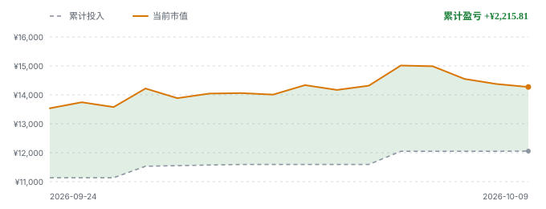

# FIRE-Progress

> 我的 FIRE 进度看板。只统计**比特币**与**标普500基金**两项资产，
> 由 GitHub Actions 自动更新，持仓数据全部取自公开仓库。

<!-- FIRE:START -->

**更新时间**：2026-10-09 08:45:57+08:00

**比特币快照**：2026-10-05（4 天前）　|　**基金净值日**：2026-09-30

> 完成度 = 当前资产 ÷ FIRE 目标。**分子看行情，分母看口径**——月开销或提取率一调整，这个百分比就会跟着变，所以它变了不一定代表资产涨跌。

| 指标 | 数值 |
| --- | ---: |
| 🎯 FIRE 目标资产 | ¥427,534.88 |
| 💰 当前资产 | ¥14,271.78 |
| 📈 完成度 | **3.338%** |
| ⏳ 距离目标 | ¥413,263.10 |

FIRE 后月开销明细 · 牡丹江 · 单人 · 租房 · 极简

共 **19 项**，合计 **¥1,532.00/月**。

**分类汇总**

| 分类 | 月支出 | 占比 |
| --- | ---: | ---: |
| 住房与水电燃气 | ¥712.00 | 46.5% |
| 日常开销 | ¥557.00 | 36.4% |
| 医疗与保障 | ¥126.00 | 8.2% |
| 风险缓冲 | ¥137.00 | 8.9% |
| **合计** | **¥1,532.00** | 100.0% |

**逐项明细**

**住房与水电燃气** · ¥712.00/月 · 占 46.5%

| 项目 | 月支出 | 占总计 |
| --- | ---: | ---: |
| 房租 | ¥500.00 | 32.6% |
| 取暖费 | ¥75.00 | 4.9% |
| 物业费 | ¥15.00 | 1.0% |
| 水费 | ¥12.00 | 0.8% |
| 电费 | ¥55.00 | 3.6% |
| 燃气/液化气 | ¥35.00 | 2.3% |
| 家电维修与更换摊销 | ¥20.00 | 1.3% |

**日常开销** · ¥557.00/月 · 占 36.4%

| 项目 | 月支出 | 占总计 |
| --- | ---: | ---: |
| 网络与手机 | ¥30.00 | 2.0% |
| 食品 | ¥319.00 | 20.8% |
| 饮用水 | ¥15.00 | 1.0% |
| 日用品 | ¥28.00 | 1.8% |
| 交通 | ¥30.00 | 2.0% |
| 探亲与返乡交通 | ¥100.00 | 6.5% |
| 衣物 | ¥30.00 | 2.0% |
| 杂项（快递与小额） | ¥5.00 | 0.3% |

**医疗与保障** · ¥126.00/月 · 占 8.2%

| 项目 | 月支出 | 占总计 |
| --- | ---: | ---: |
| 城乡居民医保 | ¥33.00 | 2.2% |
| 惠民保 | ¥13.00 | 0.8% |
| 医疗自付预留 | ¥80.00 | 5.2% |

**风险缓冲** · ¥137.00/月 · 占 8.9%

| 项目 | 月支出 | 占总计 |
| --- | ---: | ---: |
| 应急与物价缓冲 | ¥137.00 | 8.9% |

**一次性支出**（不进入 FIRE 目标，落地那年发生一次）：

| 项目 | 金额 |
| --- | ---: |
| 租房押金 | ¥1,000.00 |
| 搬家与长途运输 | ¥3,000.00 |
| 家具家电添置 | ¥8,000.00 |
| 过冬装备 | ¥3,000.00 |
| **合计** | **¥15,000.00** |

> `月开销 = 上表逐项相加`，`FIRE 目标 = 月开销 × 12 ÷ 提取率`。每项金额的依据见 [config.yaml](config.yaml) 与 [docs/FIRE-LIFE-PLAN.md](docs/FIRE-LIFE-PLAN.md)。
>
> 一次性支出**不摊进月开销**——它不产生永续现金流，摊进去会同时虚增月开销与 FIRE 目标。
>
> 含一次性支出的资金需求：**¥442,534.88**（= FIRE 目标 + 一次性支出）。

### 资产构成

| 资产 | 市值 | 占比 |
| --- | ---: | ---: |
| 比特币 | ¥13,656.09 | 95.7% |
| 标普500基金 | ¥615.69 | 4.3% |
| **合计** | **¥14,271.78** | 100.0% |

> **口径**：只统计**长期投资仓位**——比特币与标普500基金，**不含现金、存款与其他资产**。所以**卖出后进度下跌不一定是亏了**：如果钱变成了现金，那是口径边界，不是资产减少。详见下方「计入范围」。

比特币计价：**0.02484565 BTC** × ¥549,637.24 = ¥13,656.09

比特币持仓明细（快照 2026-10-05，手动更新）

| 账户 | 数量 (BTC) | 均价 (USD) |
| --- | ---: | ---: |
| 币安 | 0.00955781 | $69,270.12 |
| 欧易 | 0.01528784 | $68,090.70 |

标普500基金持仓明细

| 基金 | 市值 | 累计投入 | 持有份额 | 最新净值 |
| --- | ---: | ---: | ---: | ---: |
| 摩根标普500 A | ¥307.71 | ¥309.69 | 181.83 | 1.6923 |
| 摩根标普500 C | ¥307.98 | ¥310.00 | 183.77 | 1.6759 |

### 投入与盈亏

| 指标 | 数值 |
| --- | ---: |
| 累计投入本金 | ¥12,055.97 |
| 当前市值 | ¥14,271.78 |
| 累计盈亏 | ¥2,215.81 |
| **累计收益率** | **+18.38%** |

> 比特币本金按持仓备注中的「均价 $xx/BTC」推算，并按**当前汇率**折算成人民币，与真实买入成本存在偏差；标普500本金取自 sp500-dca 的累计投入。

### 收益曲线

> **上面板**：累计投入（虚线）与当前市值（实线），缺口即累计盈亏。**下面板**：累计收益率（盈亏 ÷ 本金），纵轴含 0。
>
> 两张图要一起看：**加仓会机械性拉低收益率**——分母（本金）变大、分子（盈亏）不变。所以收益率下降不一定是亏了，也可能只是又投了一笔；反过来，收益率上升也可能只是市场涨得比加仓快。上面板能看到本金在哪天跳升，用来解释下面板的变化。
>
> ⚠️ 上面板纵轴**不从 0 起**（本金与市值挤在窄区间里，从 0 起缺口会被压成一条看不见的线），所以斜率不代表实际涨跌幅；下面板含 0，正负可以放心读。
>
> 起点 **2026-09-24**（项目开始）。已回填的历史点由两个持仓仓库的历史文件重建（比特币按备注均价、标普500按逐日累计投入），其中比特币那部分统一按当前汇率折算，所以早期本金的绝对值有误差、趋势可信；此后每天由 Actions 直接记录。

### 进度曲线

> 曲线是**每日完成度快照**，按 `data/history.json` 里当天记录的原值连线，不回填、不重算。
>
> 图中竖虚线处是**口径调整**——FIRE 目标（分母）变了，不是资产变了，所以曲线会出现台阶。每天的目标值都记在 `data/history.json` 里，这个台阶可追溯，不是数据错误。

### 线性外推

按近 30 天的平均增速（日均 +¥48.77）线性外推，**超过 10 年**后达到目标（2049-12-20）。

> 这是线性外推，不是预测。它把近期的增速直接铺到未来，
> 而实际增速会随行情、定投额度与生活开销的变化而改变。
>
> 在这个尺度上外推结果已无参考意义——真正决定进度的是月定投额，不是等待。

数据源：[SayangChun/0.1BTC](https://github.com/SayangChun/0.1BTC)（比特币持仓，每周手动更新）、[SayangChun/sp500-dca](https://github.com/SayangChun/sp500-dca)（基金持仓）· 行情：binance:api.binance.com · 汇率：open.er-api.com

<!-- FIRE:END -->

## 计算口径

| 参数 | 取值 |
| --- | ---: |
| 月开销 | ¥1,532（由 FIRE 生活规划逐项推导） |
| 提取率 | 4.3% |
| **FIRE 目标资产** | **¥427,534.88** |

公式：`FIRE 目标 = 月开销 × 12 ÷ 提取率`，`完成度 = 当前资产 ÷ FIRE 目标`。

**月开销不再是一个拍脑袋的数字**，而是由 [`config.yaml`](config.yaml) 的 `life_plan` 段
逐项相加得到，每一项都标注了依据。改任何一项，FIRE 目标都会自动重算。

> **2026-09-27 口径变更**：月开销由 ¥2,000（拍脑袋）改为逐项推导，逐项确认 11 项省钱措施，
> 基准城市改为**牡丹江（占位，最终城市未定）**。最终口径 **¥1,532/月 → 目标 ¥427,534.88**（原 ¥558,139.53，−23.4%）。
> 这次变更会让进度曲线出现一个台阶——那是**分母变小**造成的，不是资产真的涨了。
> `data/history.json` 每天记录了当时的 `target_cny`，所以这个台阶可追溯、不是数据错误。

## FIRE 生活规划

FIRE 之后打算在**黑龙江**定居（**省内具体城市尚未确定**，当前以**牡丹江**作为占位城市）：单人、租房、极简生活。

| 项目 | 结论 |
| --- | --- |
| 定居地 | **黑龙江省内**（省内具体城市未定，牡丹江占位） |
| 生活基准 | 牡丹江（省内占位）· 单人 · 租房 · 极简 |
| 月开销 | ¥1,532（19 项） |
| FIRE 目标 | ¥427,534.88 |
| 一次性落地支出 | ¥15,000 |
| 含一次性支出的资金需求 | ¥442,534.88 |
| 对照：常规档 | 月 ¥2,800 → 目标 ¥781,395.35 |

完整的规划书见 **[docs/FIRE-LIFE-PLAN.md](docs/FIRE-LIFE-PLAN.md)**，包含：

- **城市选择**：**黑龙江省内**候选城市（牡丹江当前占位 / 鹤岗 / 伊春 / 佳木斯 / 大庆 / 黑河 / 哈尔滨）的房价、租金、
  取暖费横向对比（含「计费口径」换算——各地按建筑面积还是使用面积收，差别很大）
- **住房**：租房方案与成本，以及「租 vs 买」的完整测算（牡丹江买房隐含净回报率仅 **2.72%**，
  低于 4.3% 提取率 → **租房明显更划算，买房合计要多约 ¥64,052**）
- **每天饮食**：一周食谱、每周采购清单（≈¥115）、东北囤冬菜与腌酸菜
- **不交社保的医疗保障路径**：城乡居民医保 + 龙江惠民保 + 专项应急金，以及参保地问题
- **已明确排除的支出**：父母赡养、人情往来、旅行、手机电脑摊销、体检牙科、意外险等
  经逐项确认后不计入，连同代价一并记录在案（规划书 §6.1）
- **敏感性分析**：每多花 ¥100/月，FIRE 目标就多约 ¥27,907；基准方案的真实区间约 ¥428k–¥539k
- **风险清单与执行时间表**

> ⚠️ **¥1,532 是下限，不是中位数。**
> 130+ 项全量候选清单见 **[docs/FIRE-SPENDING-CHECKLIST.md](docs/FIRE-SPENDING-CHECKLIST.md)**。
> 其中约 ¥185/月（手机电脑更换、体检、牙科）属于 30 年内**几乎必然发生**的支出，
> 不计入的话目标看起来是 ¥427,535，**真实更可能落在 ¥479,163 上下**。
> 换算尺：**每 ¥10/月 → 目标 ±¥2,791**。

> ⚠️ 本规划的前提是**不交社保**，因此没有养老金兜底，医保只能走
> 「城乡居民医保 + 惠民保 + 专项应急金」这条路径，规划书里专门有一节讨论
> 是否要把提取率从 4.3% 收紧到 4.0%（对应目标 ¥459,600）。

## 计入范围

- ✅ [0.1BTC](https://github.com/SayangChun/0.1BTC) 仓库中的比特币持仓
- ✅ [sp500-dca](https://github.com/SayangChun/sp500-dca) 仓库中的标普500基金市值
- ❌ 法币、现金、存款、其他币种、其他一切资产

**本看板统计的是「长期投资仓位」，不是「全部净资产」。** 现金、存款、货基等一概不计入。

由此有一条要注意的推论：**卖出资产不会让进度失真，卖出后资金离开这个范围才会。**

| 情形 | 进度 | 是否真实 |
| --- | --- | --- |
| 工资入金 / 买入 | ↑ | 真实增长 |
| 池内互换（卖 BTC 买标普500） | → 不变 | 正常 |
| 卖出后把钱花掉 | ↓ | 真实减少 |
| 卖出后变成现金放着 | ↓ | **假信号**——资产并没少，只是换了形式 |

> 看到进度下跌，先看钱去哪了：如果变成了现金，那是**口径边界**造成的，不是资产减少。
>
> 为什么不把现金计入：现金余额得手动维护，而本项目坚持**零密钥、零鉴权、全自动**。
> 宁可把口径写清楚，也不引入一个需要人工更新、容易忘记的数字。

## 数据节奏

两项资产的数据更新频率不同，进度看板的数字因此有不同的时效性：

| 资产 | 数据来源 | 更新方式 | 时效 |
| --- | --- | --- | --- |
| 比特币 | [0.1BTC](https://github.com/SayangChun/0.1BTC) 的 `data/holdings.csv` | **每周手动更新** | 持仓数量有延迟，**非实时** |
| 标普500基金 | [sp500-dca](https://github.com/SayangChun/sp500-dca) | Actions 每小时自动抓取 | 净值 T+1 晚间披露 |
| FIRE 生活规划 | [`config.yaml`](config.yaml) 的 `life_plan` | **手动维护** | 改一项即改变 FIRE 目标，建议每年复核 |

> **关于比特币持仓**：数量来自手动维护的周度快照，**不代表实时持仓**。
> 看板顶部会显示快照日期与距今的天数；若超过 14 天未更新会自动告警。
> 市值部分仍按最新行情实时折算，所以「数量滞后、估值实时」。

> **关于月开销**：它是 FIRE 目标的分母来源，因此单靠自动化不够——
> 物价会变（取暖费、房租、医保保费每年都可能调整）。
> 建议每年 9–10 月复核一次 `life_plan` 的逐项金额，并跑一遍
> `python tests/test_life_plan.py` 确认口径没被改坏。

## 自动化

GitHub Actions **每小时**轮询一次，读取两个持仓仓库、抓取行情与汇率、重算进度并更新本文件；
计算结果无实质变化时不产生提交，避免刷屏。

轮询频率定得高，是因为 GitHub 的定时任务实际会比计划时间晚几小时触发——
每小时跑一次可以把最大滞后收敛到 1 小时左右。

---

*本仓库为个人资产记录，不构成任何投资建议。数据为个人口径，可能与实际存在偏差。*
