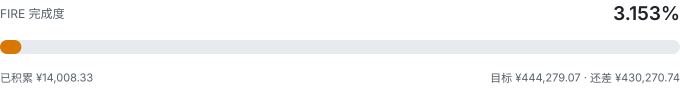
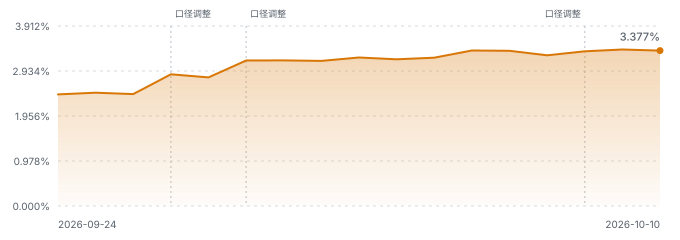

# FIRE-Progress

> 我的 FIRE 进度看板。只统计**比特币**与**标普500基金**两项资产，
> 由 GitHub Actions 自动更新，持仓数据全部取自公开仓库。

<!-- FIRE:START -->

**更新时间**：2026-10-01 05:15:24+08:00

**比特币快照**：2026-09-27（3 天前）　|　**基金净值日**：2026-09-29

> 完成度 = 当前资产 ÷ FIRE 目标。**分子看行情，分母看口径**——月开销或提取率一调整，这个百分比就会跟着变，所以它变了不一定代表资产涨跌。

| 指标 | 数值 |
| --- | ---: |
| 🎯 FIRE 目标资产 | ¥444,279.07 |
| 💰 当前资产 | ¥14,058.38 |
| 📈 完成度 | **3.164%** |
| ⏳ 距离目标 | ¥430,220.69 |

FIRE 后月开销明细 · 牡丹江 · 单人 · 租房 · 极简

共 **19 项**，合计 **¥1,592.00/月**。

**分类汇总**

| 分类 | 月支出 | 占比 |
| --- | ---: | ---: |
| 住房与水电燃气 | ¥772.00 | 48.5% |
| 日常开销 | ¥557.00 | 35.0% |
| 医疗与保障 | ¥126.00 | 7.9% |
| 风险缓冲 | ¥137.00 | 8.6% |
| **合计** | **¥1,592.00** | 100.0% |

**逐项明细**

**住房与水电燃气** · ¥772.00/月 · 占 48.5%

| 项目 | 月支出 | 占总计 |
| --- | ---: | ---: |
| 房租 | ¥550.00 | 34.5% |
| 取暖费 | ¥75.00 | 4.7% |
| 物业费 | ¥25.00 | 1.6% |
| 水费 | ¥12.00 | 0.8% |
| 电费 | ¥55.00 | 3.5% |
| 燃气/液化气 | ¥35.00 | 2.2% |
| 家电维修与更换摊销 | ¥20.00 | 1.3% |

**日常开销** · ¥557.00/月 · 占 35.0%

| 项目 | 月支出 | 占总计 |
| --- | ---: | ---: |
| 网络与手机 | ¥30.00 | 1.9% |
| 食品 | ¥319.00 | 20.0% |
| 饮用水 | ¥15.00 | 0.9% |
| 日用品 | ¥28.00 | 1.8% |
| 交通 | ¥30.00 | 1.9% |
| 探亲与返乡交通 | ¥100.00 | 6.3% |
| 衣物 | ¥30.00 | 1.9% |
| 杂项（快递与小额） | ¥5.00 | 0.3% |

**医疗与保障** · ¥126.00/月 · 占 7.9%

| 项目 | 月支出 | 占总计 |
| --- | ---: | ---: |
| 城乡居民医保 | ¥33.00 | 2.1% |
| 惠民保 | ¥13.00 | 0.8% |
| 医疗自付预留 | ¥80.00 | 5.0% |

**风险缓冲** · ¥137.00/月 · 占 8.6%

| 项目 | 月支出 | 占总计 |
| --- | ---: | ---: |
| 应急与物价缓冲 | ¥137.00 | 8.6% |

**一次性支出**（不进入 FIRE 目标，落地那年发生一次）：

| 项目 | 金额 |
| --- | ---: |
| 租房押金 | ¥1,000.00 |
| 搬家与长途运输 | ¥3,000.00 |
| 家具家电添置 | ¥8,000.00 |
| 过冬装备 | ¥3,000.00 |
| **合计** | **¥15,000.00** |

> `月开销 = 上表逐项相加`，`FIRE 目标 = 月开销 × 12 ÷ 提取率`。每项金额的依据见 [config.yaml](config.yaml) 与 [docs/FIRE-LIFE-PLAN.md](docs/FIRE-LIFE-PLAN.md)。
>
> 一次性支出**不摊进月开销**——它不产生永续现金流，摊进去会同时虚增月开销与 FIRE 目标。
>
> 含一次性支出的资金需求：**¥459,279.07**（= FIRE 目标 + 一次性支出）。

### 资产构成

| 资产 | 市值 | 占比 |
| --- | ---: | ---: |
| 比特币 | ¥13,460.87 | 95.7% |
| 标普500基金 | ¥597.51 | 4.3% |
| **合计** | **¥14,058.38** | 100.0% |

比特币计价：**0.02392337 BTC** × ¥562,666.17 = ¥13,460.87

比特币持仓明细（快照 2026-09-27，手动更新）

| 账户 | 数量 (BTC) | 均价 (USD) |
| --- | ---: | ---: |
| 币安 | 0.00864654 | $68,694.15 |
| 欧易 | 0.01527683 | $68,139.80 |

标普500基金持仓明细

| 基金 | 市值 | 累计投入 | 持有份额 | 最新净值 |
| --- | ---: | ---: | ---: | ---: |
| 摩根标普500 A | ¥298.62 | ¥299.70 | 175.93 | 1.6974 |
| 摩根标普500 C | ¥298.88 | ¥300.00 | 177.80 | 1.6810 |

### 投入与盈亏

| 指标 | 数值 |
| --- | ---: |
| 累计投入本金 | ¥11,582.91 |
| 当前市值 | ¥14,058.38 |
| 累计盈亏 | ¥2,475.47 |

> 比特币本金按持仓备注中的「均价 $xx/BTC」推算，并按**当前汇率**折算成人民币，与真实买入成本存在偏差；标普500本金取自 sp500-dca 的累计投入。

### 进度曲线

> 曲线是**每日完成度快照**，按 `data/history.json` 里当天记录的原值连线，不回填、不重算。
>
> 图中竖虚线处是**口径调整**——FIRE 目标（分母）变了，不是资产变了，所以曲线会出现台阶。每天的目标值都记在 `data/history.json` 里，这个台阶可追溯，不是数据错误。

### 线性外推

按近 30 天的平均增速（日均 +¥88.25）线性外推，**超过 10 年**后达到目标（2040-02-05）。

> 这是线性外推，不是预测。它把近期的增速直接铺到未来，
> 而实际增速会随行情、定投额度与生活开销的变化而改变。
>
> 在这个尺度上外推结果已无参考意义——真正决定进度的是月定投额，不是等待。

数据源：[SayangChun/0.1BTC](https://github.com/SayangChun/0.1BTC)（比特币持仓，每周手动更新）、[SayangChun/sp500-dca](https://github.com/SayangChun/sp500-dca)（基金持仓）· 行情：binance:data-api.binance.vision · 汇率：open.er-api.com

<!-- FIRE:END -->

## 计算口径

| 参数 | 取值 |
| --- | ---: |
| 月开销 | ¥1,592（由 FIRE 生活规划逐项推导） |
| 提取率 | 4.3% |
| **FIRE 目标资产** | **¥444,279.07** |

公式：`FIRE 目标 = 月开销 × 12 ÷ 提取率`，`完成度 = 当前资产 ÷ FIRE 目标`。

**月开销不再是一个拍脑袋的数字**，而是由 [`config.yaml`](config.yaml) 的 `life_plan` 段
逐项相加得到，每一项都标注了依据。改任何一项，FIRE 目标都会自动重算。

> **2026-09-27 口径变更**：月开销由 ¥2,000（拍脑袋）改为逐项推导，逐项确认 11 项省钱措施，
> 基准城市改为**牡丹江（占位，最终城市未定）**。最终口径 **¥1,592/月 → 目标 ¥444,279.07**（原 ¥558,139.53，−20.4%）。
> 这次变更会让进度曲线出现一个台阶——那是**分母变小**造成的，不是资产真的涨了。
> `data/history.json` 每天记录了当时的 `target_cny`，所以这个台阶可追溯、不是数据错误。

## FIRE 生活规划

FIRE 之后打算在**东北**定居（**具体城市尚未确定**，当前以**牡丹江**作为占位城市）：单人、租房、极简生活。

| 项目 | 结论 |
| --- | --- |
| 生活基准 | 牡丹江（占位）· 单人 · 租房 · 极简 |
| 月开销 | ¥1,592（19 项） |
| FIRE 目标 | ¥444,279.07 |
| 一次性落地支出 | ¥15,000 |
| 含一次性支出的资金需求 | ¥459,279.07 |
| 对照：常规档 | 月 ¥2,800 → 目标 ¥781,395.35 |

完整的规划书见 **[docs/FIRE-LIFE-PLAN.md](docs/FIRE-LIFE-PLAN.md)**，包含：

- **城市选择**：牡丹江（当前占位）/ 鹤岗 / 伊春 / 佳木斯 / 大庆 / 黑河 / 沈阳 的房价、租金、
  取暖费横向对比（含「计费口径」换算——各地按建筑面积还是使用面积收，差别很大）
- **住房**：租房方案与成本，以及「租 vs 买」的完整测算（牡丹江买房隐含净回报率仅 **3.06%**，
  低于 4.3% 提取率 → **租房明显更划算，买房合计要多约 ¥50,099**）
- **每天饮食**：一周食谱、每周采购清单（≈¥115）、东北囤冬菜与腌酸菜
- **不交社保的医疗保障路径**：城乡居民医保 + 龙江惠民保 + 专项应急金，以及参保地问题
- **已明确排除的支出**：父母赡养、人情往来、旅行、手机电脑摊销、体检牙科、意外险等
  经逐项确认后不计入，连同代价一并记录在案（规划书 §6.1）
- **敏感性分析**：每多花 ¥100/月，FIRE 目标就多约 ¥27,907；基准方案的真实区间约 ¥444k–¥556k
- **风险清单与执行时间表**

> ⚠️ **¥1,592 是下限，不是中位数。**
> 130+ 项全量候选清单见 **[docs/FIRE-SPENDING-CHECKLIST.md](docs/FIRE-SPENDING-CHECKLIST.md)**。
> 其中约 ¥185/月（手机电脑更换、体检、牙科）属于 30 年内**几乎必然发生**的支出，
> 不计入的话目标看起来是 ¥444,279，**真实更可能落在 ¥495,907 上下**。
> 换算尺：**每 ¥10/月 → 目标 ±¥2,791**。

> ⚠️ 本规划的前提是**不交社保**，因此没有养老金兜底，医保只能走
> 「城乡居民医保 + 惠民保 + 专项应急金」这条路径，规划书里专门有一节讨论
> 是否要把提取率从 4.3% 收紧到 4.0%（对应目标 ¥477,600）。

## 计入范围

- ✅ [0.1BTC](https://github.com/SayangChun/0.1BTC) 仓库中的比特币持仓
- ✅ [sp500-dca](https://github.com/SayangChun/sp500-dca) 仓库中的标普500基金市值
- ❌ 法币、其他币种、其他一切资产

## 数据节奏

两项资产的数据更新频率不同，进度看板的数字因此有不同的时效性：

| 资产 | 数据来源 | 更新方式 | 时效 |
| --- | --- | --- | --- |
| 比特币 | [0.1BTC](https://github.com/SayangChun/0.1BTC) 的 `data/holdings.csv` | **每周手动更新** | 持仓数量有延迟，**非实时** |
| 标普500基金 | [sp500-dca](https://github.com/SayangChun/sp500-dca) | Actions 每小时自动抓取 | 净值 T+1 晚间披露 |
| FIRE 生活规划 | [`config.yaml`](config.yaml) 的 `life_plan` | **手动维护** | 改一项即改变 FIRE 目标，建议每年复核 |

> **关于比特币持仓**：数量来自手动维护的周度快照，**不代表实时持仓**。
> 看板顶部会显示快照日期与距今的天数；若超过 14 天未更新会自动告警。
> 市值部分仍按最新行情实时折算，所以「数量滞后、估值实时」。

> **关于月开销**：它是 FIRE 目标的分母来源，因此单靠自动化不够——
> 物价会变（取暖费、房租、医保保费每年都可能调整）。
> 建议每年 9–10 月复核一次 `life_plan` 的逐项金额，并跑一遍
> `python tests/test_life_plan.py` 确认口径没被改坏。

## 自动化

GitHub Actions **每小时**轮询一次，读取两个持仓仓库、抓取行情与汇率、重算进度并更新本文件；
计算结果无实质变化时不产生提交，避免刷屏。

轮询频率定得高，是因为 GitHub 的定时任务实际会比计划时间晚几小时触发——
每小时跑一次可以把最大滞后收敛到 1 小时左右。

---

*本仓库为个人资产记录，不构成任何投资建议。数据为个人口径，可能与实际存在偏差。*
